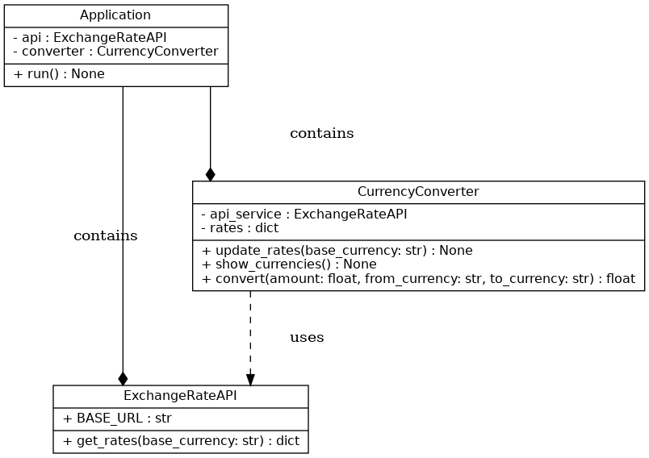

# Currency Converter (OOP)

Jednoduchý objektově orientovaný převodník měn v Pythonu.

## Funkce
- aktuální kurzy měn z API
- objektově orientovaný návrh
- validace vstupů
- konzolové rozhraní
- snadné rozšíření projektu

## Použité technologie
- Python
- Requests
- ExchangeRate API

## Instalace

```bash
pip install -r requirements.txt
```

## Spuštění

```bash
python main.py
```

## UML Diagram
Součástí projektu je i UML class diagram.


